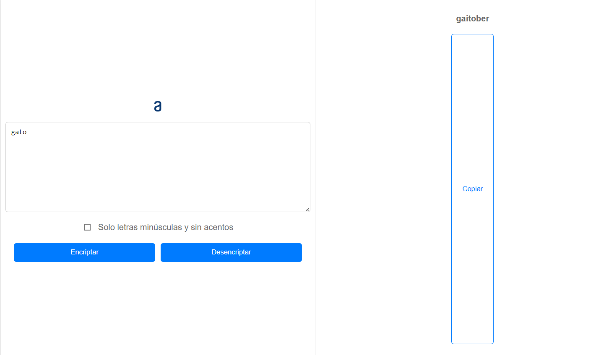
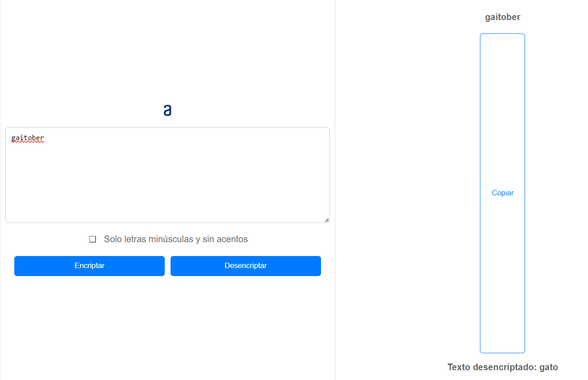

# Proyecto Challenge 1 Alura LATAM
Creación de un ecriptador de texto en HTML, CSS y JavaScript.

## Estudiante: 
Eduardo Chero
 
## Encriptación
El usuario ingresará una palabra o frase en minúsculas y esta siguiendo unos parámetros modificara la palabra convirtiéndola en una encriptada



## Desencritación
El usuario le puede dar click al boton copiar para que lo ingrese nuevamente en el textbox para darle al botón de desencriptar, entonces le mostrará la palabra desencriptada.



## Logica del encriptador

Para la lógica de la encriptacion se nos pide que las vocales que contenga la frase sean cambiadas de la siguiente manera:
```
La letra "e" es convertida para "enter"
La letra "i" es convertida para "imes"
La letra "a" es convertida para "ai"
La letra "o" es convertida para "ober"
La letra "u" es convertida para "ufat"